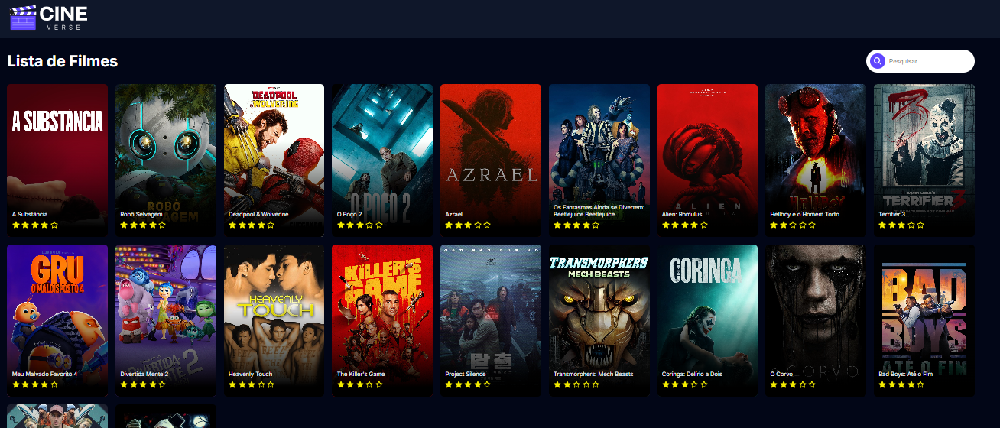

# CINE COM NEXTJS
👨‍🏫ESTE PROJETO É UM APLICATIVO DE CATÁLOGO DE FILMES, QUE CONSOME DADOS DA API DO TMDB.  

 <br>  

## DESCRIÇÃO:
Este projeto é um **aplicativo de filmes** desenvolvido com **React** e **Next.js**, que consome dados da API do The Movie Database (TMDb). O objetivo principal é exibir uma lista de filmes com funcionalidades interativas, como pesquisa, exibição de detalhes do filme e classificação por estrelas.

## FUNCIONALIDADES:
1. **Carregamento com Spinner**:
   - Enquanto os filmes estão sendo carregados da API, uma animação de carregamento (spinner) é exibida na tela usando o componente `ReactLoading`. O estilo de carregamento é configurado como 'spin', com uma cor roxa (`#6046ff`).

2. **Cartão de Filme**:
   - Cada filme é exibido dentro de um **cartão de filme**, com a imagem do pôster, título, e uma classificação por estrelas baseada no voto médio do filme.
   - Ao passar o mouse sobre o cartão (efeito hover), mais detalhes sobre o filme aparecem, como a descrição e um botão "Ver Mais".
   - A imagem do pôster escurece durante o hover, enquanto o conteúdo adicional (descrição e botão) é revelado com animações suaves.

3. **Listagem de Filmes**:
   - A listagem é organizada em uma grade (`grid`) responsiva, adaptando-se a diferentes tamanhos de tela.
   - É possível realizar buscas dentro da lista de filmes usando uma barra de pesquisa, que filtra os filmes dinamicamente à medida que o usuário digita.

4. **Barra de Pesquisa (Search Bar)**:
   - A barra de pesquisa permite que os usuários filtrem os filmes por título. A entrada do usuário é processada em tempo real e os resultados são atualizados instantaneamente.

5. **Avaliação por Estrelas (Star Rating)**:
   - O sistema de avaliação exibe as notas dos filmes em um formato visual de estrelas. A pontuação é convertida para uma escala de 1 a 5 estrelas, onde a nota média é arredondada e representada com estrelas preenchidas (`FaStar`) e não preenchidas (`FaRegStar`).

6. **Navegação (Navbar)**:
   - A aplicação inclui uma barra de navegação fixa no topo com um logo. A barra de navegação permanece visível enquanto o usuário rola a página.

## EXECUTANDO O PROJETO:
1. **Instalar as dependências do projeto**:
   - Execute o comando no diretório `CODIGO/`:
     ```cmd
     npm install
     ```
   Este comando instala todas as dependências listadas no arquivo `package.json` do seu projeto. Certifique-se de estar no diretório do seu projeto ao executar este comando.

2. **Configuração da API**:
   - Abra o arquivo `./CODIGO/.env` e adicione sua chave da [API TMDb](https://developer.themoviedb.org/reference/intro/getting-started):
   ```bash
   NEXT_PUBLIC_API_KEY=YOUR_TMDB_API_KEY
   ```

3. **Subindo o Servidor:**
   - Para subir o servidor abra Terminal/CMD e digite o seguinte comando:
   ```bash
   npm run dev
   ```
   - Acesse o APP no navegador visitando [`http://localhost:3000/`](http://localhost:3000/).

4. **Funcionalidades**:
   - Ao acessar a página principal, o usuário verá a lista de filmes populares.
   - A barra de pesquisa permite filtrar os filmes por título.
   - Ao clicar no botão "Ver Mais" de um filme, você pode implementar a funcionalidade para abrir uma página de detalhes específica do filme.
   
## NÃO SABE?
- Entendemos que para manipular arquivos em `HTML`, `CSS` e outras linguagens relacionadas, é necessário possuir conhecimento nessas áreas. Para auxiliar nesse aprendizado, oferecemos cursos gratuitos disponíveis:
* [CURSO DE NEXTJS](https://github.com/VILHALVA/CURSO-DE-NEXTJS)
* [CURSO DE HTML E CSS](https://github.com/VILHALVA/CURSO-DE-HTML-E-CSS)
* [CURSO DE SCSS](https://github.com/VILHALVA/CURSO-DE-SCSS)
* [CURSO DE TYPESCRIPT](https://github.com/VILHALVA/CURSO-DE-TYPESCRIPT)
* [CURSO DE NODEJS](https://github.com/VILHALVA/CURSO-DE-NODEJS)
* [CONFIRA MAIS CURSOS](https://github.com/VILHALVA?tab=repositories&q=+topic:CURSO)

## CREDITOS:
- [PROJETO CRIADO PELO "Larissakich"](https://github.com/Larissakich/nextjs-movies-app-tmdb)
- [PROJETO EDITADO PELO VILHALVA](https://github.com/VILHALVA)


